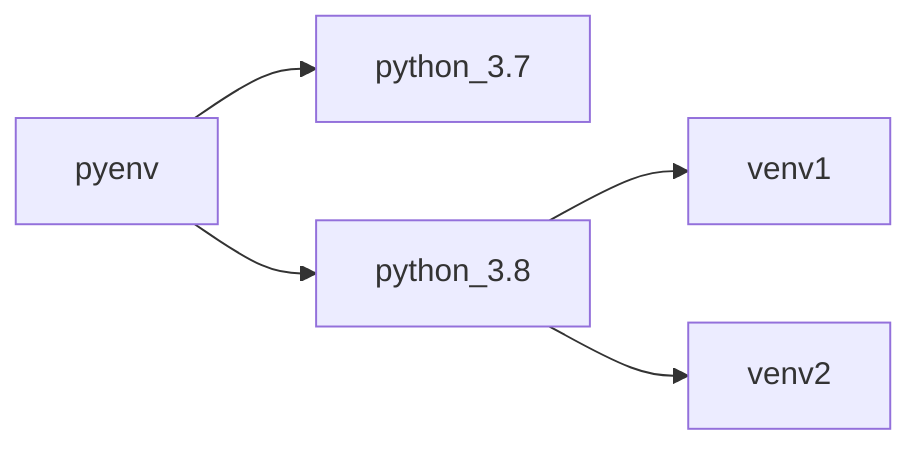

# python 环境管理与配置

[toc]

## **How venvs work**

`sys.prefix` 和 `sys.exec_prefix` 指向虚拟环境的目录，而 `sys.base_prefix`和`sys.base_exec_prefix` 指向用于创建虚拟环境的 base python。
因此，通过检查 `sys.prefix == sys.base_predix` 来判断当前解释器是否是虚拟环境

使用 `python -m venv /path/to/new/virtual/environment` 生成虚拟环境，生成的 venv 与 base 的 version 相同，且共用解释器


借助 pyenv 的使用方式



---

## pyenv 

```
brew install pyenv
brew uninstall pyenv
```


查询可安装的 python 版本

```
pyenv install --list
```

安装指定版本

```
pyenv install 3.8.5
```

查询当前所有已安装版本

```
pyenv versions
```

---

配置当前系统所使用的 python 版本

```
pyenv global <xxxxx>
pyenv shell <xxxxx>
eval "$shell"
```


查看当前全局所使用的 python 版本

```
pyenv global 
```

**虚拟环境管理**

使用 pyenv 进行 python 版本管理，但具体项目使用时应该使用`版本环境` 的方式管理，避免不同项目使用同一个基础环境的互相干扰

```
$ python3.7 -m venv ./py37async
$ source ./py37async/bin/activate
$ deactivate [退出]
```

**项目虚拟环境管理**

注意 poetry 的安装是基于现有 python 的，因此 pyenv 可以先指定 shell 的 python 版本再安装。


```
poetry install
source .venv/bin/activate
```


pycahrm 插件：

```
EnvFile
```

**poetry**


```
poetry init # 初始化已经存在的项目
poetry add pendulum # 添加模块（或者修改 `pyproject.toml`文件）
```

---

