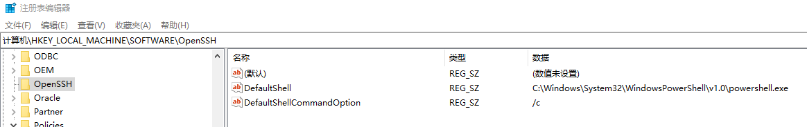
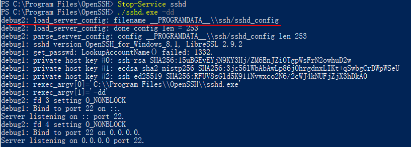

# windows ssh服务

Author:HJY 
<time>2020-06-19</time>

<kbd>H</kbd>

[TOC]

---

## 参考链接

- [教程](https://github.com/PowerShell/Win32-OpenSSH/wiki)
- [下载链接](https://github.com/PowerShell/Win32-OpenSSH/releases)

## 安装OpenSSH-Win64

> 本文介绍离线安装的方式，可联网情况下的安装不介绍
> 注：本文适用的命令均在powershell执行，非cmd
> 注：powershell以管理员方式启动

1. 下载OpenSSH-Win64.zip

2. 解压文件于路径`C:Program Files\OpenSSH`(若路径不存在则创建，同时要确保具备写权限)

3. 以管理员身份启动`Powershell console`,运行命令：

   ```powershell
   PS C:\Program Files\OpenSSH> powershell.exe -ExecutionPolicy Bypass -File .\install-sshd.ps1
   ```

4. 添加防火墙入口规则以允许`sshd.exe`被连接

   ```powershell
   > New-NetFirewallRule -Name sshd -DisplayName 'OpenSSH Server (sshd)' -Enabled True -Direction Inbound -Protocol TCP -Action Allow -LocalPort 22
   ```

5. 启动sshd或关闭sshd

   ```powershell
   > net start sshd   # 或者 Start-Service sshd
   > net stop sshd		# 或者 Stop-Service sshd
   ```

6. 可选配置

   - 配置默认shell
     下面的命令将默认启动shell设置为powershell

     ```powershell
     > New-ItemProperty -Path "HKLM:\SOFTWARE\OpenSSH" -Name DefaultShell -value "C:Windows\System32\WindowsPowerShell\v1.0\powershell.exe" -PropertyType String -Force
     
     > New-ItemProperty -Path "HKLM:\SOFTWARE\OpenSSH" -Name DefaultShellCommandOption -value "/c" -Property String -Force
     ```

     

   - 配置sshd服务自启动

     ```powershell
     Set-Service sshd -StartupType Automatic
     ```

## 卸载OpenSSH-Win64

1. 在上面的路径下执行卸载脚本

   ```powershell
   > powershell.exe -ExecutionPolicy Bypass -File .\uninstall-sshd.ps1
   ```

---

## 其他配置

### 修改ssh 22端口

> 避免被端口扫描或者恶意攻击而修改

#### 方式1

> 通过修改配置文件，永久生效

1. 使用调试模式查找sshd启动时加载的配置文件

   ```powershell
   > C:
   > cd C:\Program Files\OpenSSH
   > Stop-Service sshd
   > ./sshd -dd
   ```

   

   可以看到配置路径为`%PROGRAMDATA%/ssh/sshd_config`

   <kbd>WIN</kbd>+<kbd>R</kbd>,输入`%PROGRAMDATA%//ssh`

2. 编辑`sshd_config`

   ```
   Port 31458
   ```

3. 修改防火墙入站规则

   ```powershell
   > Set-netfirewallrule -Name sshd -LocalPort 31458
   ```

4. 重启sshd

#### 方式2

> 通过服务启动时使用参数，非永久，但灵活

```powershell
./sshd.exe -p <port>
Set-netfirewallrule -Name sshd -LocalPort <port>
```


## 使用

ssh访问

```powershell
ssh username@servername  			#默认22端口
ssh -p <port> username@servername 	# 非22端口
```

