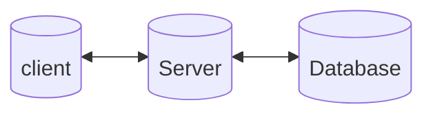
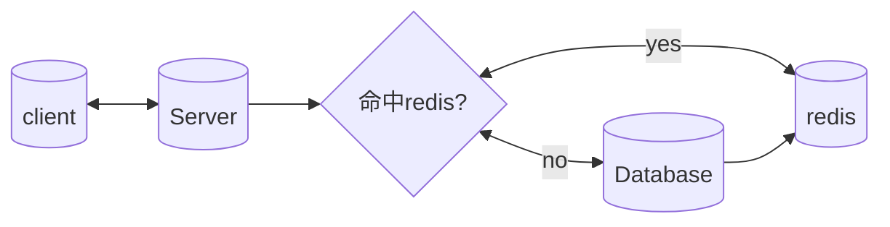

# redis 的运用 1

[toc]


## sample project design learning

> 设计一个simple project 来学习 redis 解决的问题

### **引入 redis 前的模型**



完成这个模型环境的构建，我们需要做到下面三个部分：

1. python http server
2. docker 快速搭建 mysql

   ```shell
   docker pull mysql
   docker run --name mysql -e MYSQL_ROOT_PASSWORD=aftership -d mysql:8.0.32-debian
   
   ```

   
3. wrk 模拟 client
   1. 我们使用 wrk 这个压测工具来实现高压请求量，我们需要编写 lua 脚本


### 引入 redis 的模型




### 缓存击穿

描述：redis unexist, DB exist

解决方案

- 随机时间

  基本过期时间 + random 时间间隔 （即相同业务数据写缓存时，在基础过期时间之上，再加一个随机的过期时间，让数据在未来一段时间内慢慢过期，避免瞬时全部过期，对 DB 造成过大压力。）

- 预热
  预先把热门数据提前存入 Redis 中，并设热门数据的过期时间超大值。

- 使用锁

### 缓存穿透

描述：Redis  unexist，DB unexist
导致每次请求都会穿透到数据库，缓存成了摆设，对数据库产生很大压力从而影响正常服务

解决方案

- 缓存空值
- 布隆过滤器

### 缓存雪崩

描述：缓存雪崩是发生在大量数据同时失效的场景，而缓存击穿(失效)是在某个热点数据失效的场景，这是他们最大的区别。

解决方案

- 过期时间添加随机值
- 接口限流
- 

服务熔断和限流属于在发生了缓存雪崩，如何降低雪崩对数据库造成的影响的方案。


